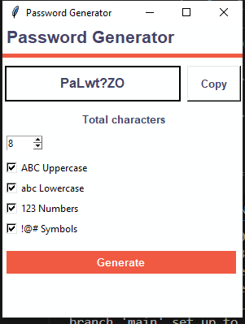

Password Generator
Este é um aplicativo simples de geração de senhas seguras desenvolvido em Python usando a biblioteca Tkinter para a interface gráfica.

Funcionalidades
✅ Geração de senhas aleatórias
✅ Personalização do comprimento da senha (1 a 20 caracteres)
✅ Opções para incluir letras maiúsculas, minúsculas, números e símbolos
✅ Botão para copiar a senha para a área de transferência

Requisitos
Certifique-se de ter o Python 3.x instalado no seu sistema.

Como Executar
Baixe o código-fonte.
Execute o script com o comando:
bash
Copiar
Editar
python nome_do_arquivo.py
Use a interface para gerar e copiar senhas.
Bibliotecas Utilizadas
tkinter (Interface gráfica)
random (Geração de senhas aleatórias)
string (Conjunto de caracteres)

📌 

Licença
Este projeto é de código aberto e pode ser usado livremente
